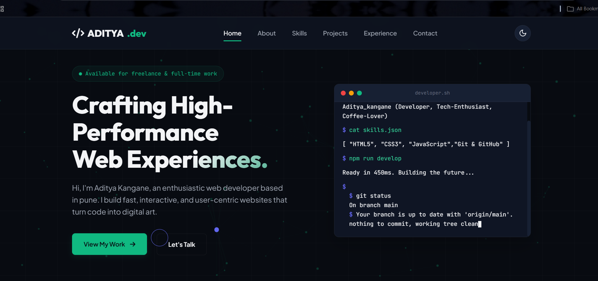

# 🌐 Aditya Kangane — Developer Portfolio

<p align="center">

<a href="https://github.com/kanganeaditya25-spec">

</a>

<a href="https://www.linkedin.com/in/aditya-kangane/">

</a>


</p>

<p align="center">


</p>

---

<p align="center">



</p>

<h3 align="center">

Modern • Interactive • Responsive • Performance Focused

</h3>

<p align="center">

### 🌐 Live Portfolio

## **https://aditya-portfolio-dev.vercel.app**

</p>

---

# 👋 Hello, I'm Aditya Kangane

I'm a **Computer Engineering student**, aspiring **Software Developer**, and **AI enthusiast** passionate about building modern web applications and solving real-world problems through technology.

I enjoy creating elegant user experiences, writing clean and maintainable code, learning modern technologies, and continuously improving my software engineering skills.

This repository contains the complete source code of my personal portfolio website, designed to showcase my projects, technical skills, certifications, achievements, and development journey.

---

# 🌐 About This Portfolio

This portfolio represents my passion for technology and software development.

Built entirely using **HTML5**, **CSS3**, and **Vanilla JavaScript**, it demonstrates strong front-end fundamentals without relying on heavy frameworks.

The website has been crafted with emphasis on:

- Modern UI/UX
- Responsive Design
- Accessibility
- Performance
- Interactive User Experience
- Clean Code Architecture
- Developer-focused Animations

---

# 👨‍💻 About the Developer

<table>

<tr>

<td width="35%" align="center">


</td>

<td width="65%">

## Aditya Kangane

🎓 Computer Engineering Student

💻 Aspiring Full Stack Developer

🤖 AI & Machine Learning Enthusiast

🌐 Frontend Developer

🚀 Passionate about Software Engineering & Modern Web Development

📍 Pune, Maharashtra, India

📚 Always learning new technologies and building meaningful projects.

</td>

</tr>

</table>

---

# ⚙️ Technology Stack

<p align="center">


</p>

## 📚 Currently Learning

- Backend Development
- Node.js
- REST APIs
- Artificial Intelligence
- Machine Learning
- Cloud Computing
- Database Systems

---

# 💼 Technical Skills

| Category | Technologies |
|------------|--------------|
| Languages | Java, Python, C, JavaScript |
| Frontend | HTML5, CSS3, Responsive Web Design |
| Backend | Learning Node.js & REST APIs |
| Version Control | Git, GitHub |
| Design | UI/UX Fundamentals, Figma |
| AI | Prompt Engineering, AI Tools, ML Fundamentals |
| Tools | VS Code, GitHub, Vercel |

---

# ✨ Portfolio Features

- 🌙 Dark & Light Theme
- 🎨 Modern UI Design
- 🖱️ Custom Animated Cursor
- ⚡ Smooth Page Animations
- 🔵 Interactive Particle Background
- 💻 Developer CLI Terminal
- 📂 Dynamic Project Showcase
- 📈 Experience Timeline
- 📬 Contact Form
- 📱 Fully Responsive Design
- 🚀 Performance Optimized
- ♿ Accessibility Focused
- 🧩 Built with Pure HTML, CSS & JavaScript

---

# 📂 Repository Structure

```text
portfolio/

├── assets/
│   ├── profile.png
│   ├── portfolio-preview.png
│   └── portfolio-demo.gif
│
├── css/
│   └── style.css
│
├── js/
│   ├── main.js
│   └── particles.js
│
├── index.html
├── LICENSE
└── README.md
```

---

# 📌 Website Sections

- 🏠 Hero
- 👨 About
- ⚙️ Skills
- 🚀 Projects
- 💼 Experience
- 📜 Certifications
- 📬 Contact

Each section has been carefully designed to provide visitors with a comprehensive overview of my technical expertise, development journey, and professional growth.

---

# 🎯 Purpose

This portfolio aims to:

- Showcase my software projects
- Demonstrate my frontend development skills
- Highlight technical expertise
- Present my engineering journey
- Build a strong professional presence
- Connect with recruiters and fellow developers
- Share my passion for technology

---

# 📊 GitHub Statistics

<p align="center">


</p>

<p align="center">


</p>

---

# 🤝 Connect With Me

I'm always open to discussions about:

- 💻 Software Development
- 🌐 Web Development
- 🤖 Artificial Intelligence
- 🚀 Open Source
- 💼 Internship Opportunities
- 🤝 Collaboration
- 🎯 Innovative Engineering Projects

### GitHub

https://github.com/kanganeaditya25-spec

### LinkedIn

https://www.linkedin.com/in/aditya-kangane/

### Portfolio

https://aditya-portfolio-dev.vercel.app

---

# 📄 License

**Copyright © 2026 Aditya Kangane. All Rights Reserved.**

This repository is proprietary and intended solely to showcase my personal work.

Unless explicit written permission is granted by the author:

- ❌ Do not copy this project.
- ❌ Do not redistribute the source code.
- ❌ Do not reuse the UI/UX design.
- ❌ Do not reproduce assets or branding.
- ❌ Do not publish modified versions.

Please refer to the **LICENSE** file for complete licensing information.

---

<p align="center">

## ⭐ Thank you for visiting!

If you enjoyed exploring my work, consider giving this repository a ⭐.

Let's build something meaningful through technology.

<br>

**Designed & Developed with ❤️ by Aditya Kangane**

Computer Engineering Student • Software Developer • AI Enthusiast

© 2026 Aditya Kangane. All Rights Reserved.

</p>